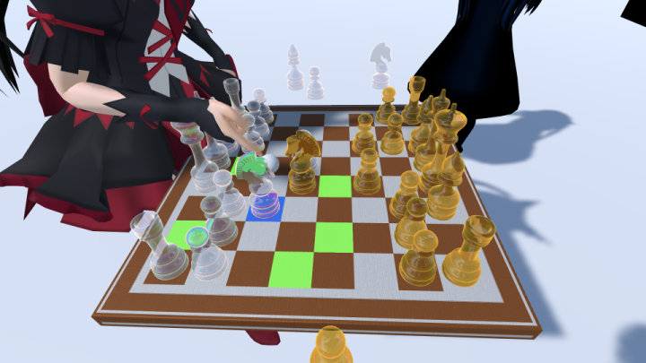
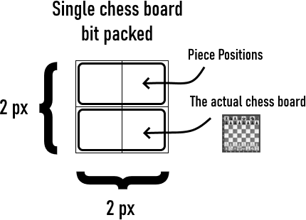
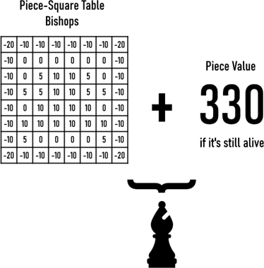

# Chess Shader with AI

A simple AI implemented using the classic minimax algorithm except it's on a GPU.

## Problems
* No en croissant (too lazy to implement)
* Castling during a check (too lazy to check)
* Pawn promotions only works on pieces that are already captured (i.e. If the pawn reaches the end, your queens alive but the rooks dead, the pawn becomes a rook.) This is because there's no room left to store extra information based on how I implemented stuff
* Depth of 2, this AI's big dumb in the late game
* ~~Bad board evaluation function, I just copied some numbers off a site~~ (I fixed a big bug so it should work ok now)
* Lots of wasted space, no dynamic memory allocation in shadurs

## Setup for VRChat (Sorry doesn't work in-game yet, the setups wrong)
1. Import the ChessShaderWithAI.unitypackage
2. Put the ChessAI prefab on your avatar
3. I suggest using FinalIK or Rigidbodies to plant the chess board in world space, and the [Inventory System](https://github.com/Xiexe/VRCInventorySystem) to enable/disable the game object.

## Q & A
1. What's the difference between the "New Game" and "Reset" buttons?
The randomness helps the AI to pick moves that cost the same. "New Game" generates a new random seed so the AI doesn't pick the same sequence. "Reset" sets the randomness back to its initial state.

## How It Works
### Chessboard

* The bottom two pixels contain a bit packed representation of an chessboard as how we would see it. 
* The top two pixels contain the (y, x) positions of every single piece.
* The bottom two pixels are only good for moving and capturing pieces, it's fast to check where the piece can go. The top two pixels are good for the AI because it needs to generate an entire tree of moves. If the AI wants to know where the Queen is, it saves time looping through the entire board searching for it.

### Min-max tree

* The min-max tree is generated through six steps, each with a waiting period of 15ms in between to help reduce GPU stress.
* The first 151 boards are generated from the current board position, there's a total of 151 moves that can be done per turn.
* From those 151 boards, the AI generates another 151 for every single one.
* At the end of the cycle, the path that benefits the computer according to the evaluation function is picked.

### Board evaluation

* For the evaluation function I copied from https://www.chessprogramming.org/Simplified_Evaluation_Function with minor modifications
* Each piece has a different table influencing where to go and a piece value determining its importance. The king has two tables, early game and late game tables to determine how it moves
* The entire board score is (White position score + white piece score) - (Black position score + black piece score)

#### Thanks to [Merlin](https://github.com/Merlin-san/) and d4rkpl4y3r for fixing my bit packing stuff.
If you have any question contact me at [@SCRNinVR](https://twitter.com/SCRNinVR) or on Discord, SCRN#8008
